 

  

Olá! Sou Leo, desenvolvedor apaixonado por resolver problemas com tecnologia.

Hoje trabalho como desenvolvedor Full Stack, construindo produtos ponta a ponta com React + TypeScript no frontend e Java + Spring Boot no backend, conectando com bancos de dados relacionais como PostgreSQL e MySQL.

Minha base forte continua no desenvolvimento Mobile com Android nativo e Flutter, com experiência em arquiteturas MVVM, MVI, MVC, MVP e Clean Architecture.

Durante minha experiência na Itália, atuei como desenvolvedor Mobile em grandes empresas como Banca Intesa e Divitech, aprofundando minha especialização em produtos de alto impacto. Essa jornada começou no banco Next, onde descobri minha paixão por criar soluções mobile robustas.

Também atuo com Docker, boas práticas de API REST, observabilidade e organização de código com princípios SOLID e separação de responsabilidades, sempre equilibrando qualidade e velocidade de entrega.

Tenho acompanhado de perto a evolução das IAs para acelerar o desenvolvimento, aumentar a produtividade e reduzir o tempo de entrega com mais qualidade técnica.

Meu objetivo é gerar impacto global, integrando Mobile e Backend de forma escalável, eficiente e com excelente experiência de usuário.

 

 

  

 

  

 

  

