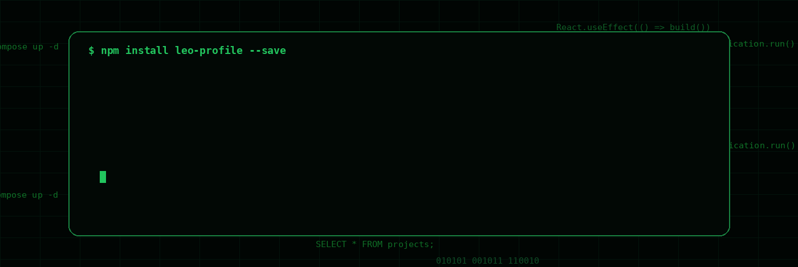
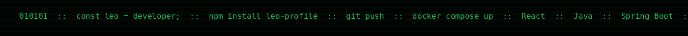
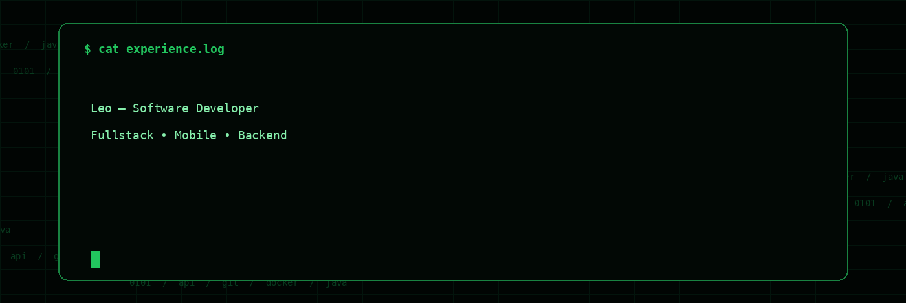

---

 

 

  

Ola! Sou Leo, desenvolvedor apaixonado por resolver problemas com tecnologia.

Hoje trabalho como desenvolvedor Fullstack, construindo produtos ponta a ponta com React + TypeScript no frontend e Java + Spring Boot no backend, conectando com bancos de dados relacionais como PostgreSQL e MySQL.

Minha base forte continua no desenvolvimento Mobile com Android nativo e Flutter, com experiencia em arquiteturas MVVM, MVI, MVC, MVP e Clean Architecture.

Durante minha experiencia na Italia, atuei como desenvolvedor Mobile em grandes empresas como Banca Intesa e Divitech, aprofundando minha especializacao em produtos de alto impacto. Essa jornada comecou no banco Next, onde descobri minha paixao por criar solucoes mobile robustas.

Tambem atuo com Docker, boas praticas de API REST, observabilidade e organizacao de codigo com principios SOLID e separacao de responsabilidades, sempre equilibrando qualidade e velocidade de entrega.

Tenho acompanhado de perto a evolucao das IAs para acelerar desenvolvimento, aumentar produtividade e reduzir tempo de entrega com mais qualidade tecnica.

Meu objetivo e gerar impacto global, integrando Mobile e Backend de forma escalavel, eficiente e com excelente experiencia de usuario.

---

 

---

 

  

---

## LIVE DASHBOARD

 

 

---

## CONNECT

 

&nbsp;

&nbsp;

 

  

